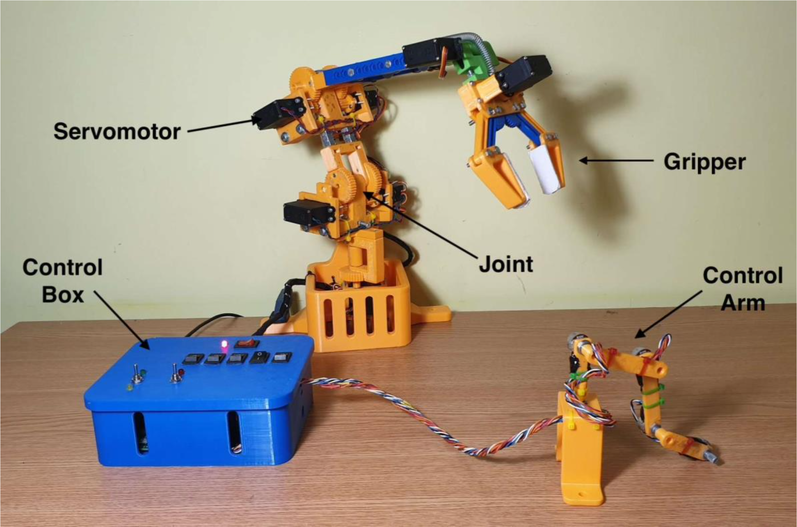

# RobotArm

This is a 3D printed robot arm that has 4 axis of motion, the movement is achieved using adapted servomotors and is controlled by a smaller arm. The software interprets the angle of every joint from the controlled arm and commands the servomotors from the robot in such a way to reproduce the motion of the small arm.

